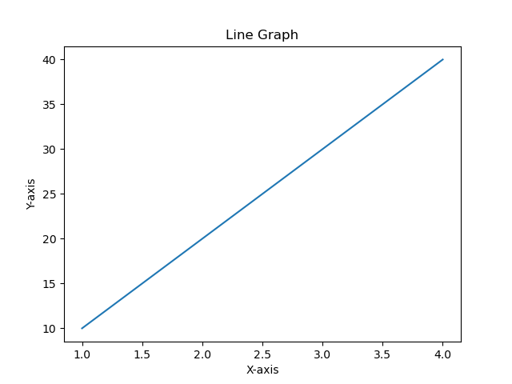
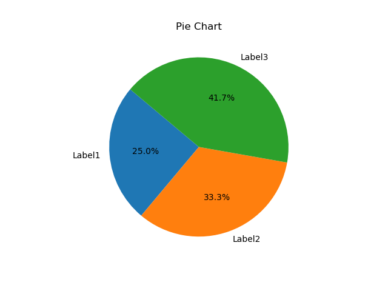

# Text-2-Graph

A command-line tool for creating graphs from text, made with Python.

## Features

- Create line graphs and pie charts (More types in the future).
- Easily specify X-axis and Y-axis data.
- Customize pie chart segments with labels.

## Installation

1. Clone the repository:
   ```bash
   git clone https://github.com/7-10-16/text2graph.git
   ```

2. Navigate into the new directory:
   ```bash
   cd text2graph
   ```

3. Make sure dependencies are installed:
   ```bash
   pip install -r requirements.txt
   ```

## Usage:
### 📈 Line Graph:
  ```bash
  python main.py --type line --x_data 1 2 3 4 --y_data 10 20 30 40
  ```


<details>
<summary> Verbose breakdown </summary>
   
+ python main.py: This runs your Python script named main.py.
  
+ --type line: This specifies that you want to create a line graph. The --type flag is followed by the argument value line.
  
+ --x_data: 1 2 3 4: This provides the X-axis data points for your graph. In this case, the X-axis data is 1, 2, 3, and 4.
  
+ --y_data: 10 20 30 40: This provides the Y-axis data points for your graph. The Y-axis data is 10, 20, 30, and 40.
  

Putting it all together, the command is telling the CLI to create a line graph using the X-axis data [1, 2, 3, 4] and the Y-axis data [10, 20, 30, 40].

When you run this command, the CLI will process the input, generate a line graph based on the provided data, and display the graph using the matplotlib library. The graph will show the X-axis values on the horizontal axis and the corresponding Y-axis values on the vertical axis.

You can customize this command by changing the values of --x_data and --y_data.
</details>

### 🥧 Pie Chart:
```bash
python main.py --type pie --x_data 1 2 3 --y_data 30 40 50 --labels Label1 Label2 Label3
```

<details>
<summary> Verbose breakdown </summary>

+ python main.py: This runs your Python script named main.py.

+ --type pie: This specifies that you want to create a pie chart. The --type flag is followed by the argument value pie.

+ --x_data 1 2 3: This provides the data points for the pie chart segments. In this case, the data points are 1, 2, and 3.

+   --y_data 30 40 50: This provides the sizes or values of the corresponding segments. The sizes are 30, 40, and 50.

+   --labels Label1 Label2 Label3: This provides labels for the pie chart segments. The labels are "Label1", "Label2", and "Label3".
  

Putting it all together, the command is telling the CLI to create a pie chart with segments labeled "Label1", "Label2", and "Label3". The sizes of the segments are 30, 40, and 50.

When you run this command, the CLI will process the input, generate a pie chart based on the provided data and labels, and display the chart using the matplotlib library. The pie chart will show the proportions of each segment relative to the whole.

You can customize this command by changing the data points and labels to create different pie charts with different segment sizes and labels.
</details>

## Screenshots
### Line Graph:


### Pie Chart:



## Contributing

Contributions are welcome! Please follow these steps:

1. 🍴 Fork the repository.
2. 🌲 Create a new branch: `git checkout -b feature/your-feature-name`.
3. 💒 Commit your changes: `git commit -m 'Add your feature'`.
4. 🫸 Push to the branch: `git push origin feature/your-feature-name`.
5. 🙏 Submit a pull request.

## Acknowledgements

- [argparse](https://docs.python.org/3/library/argparse.html) for command-line argument parsing.
- [matplotlib](https://matplotlib.org/stable/gallery/index.html) for graph generation.


